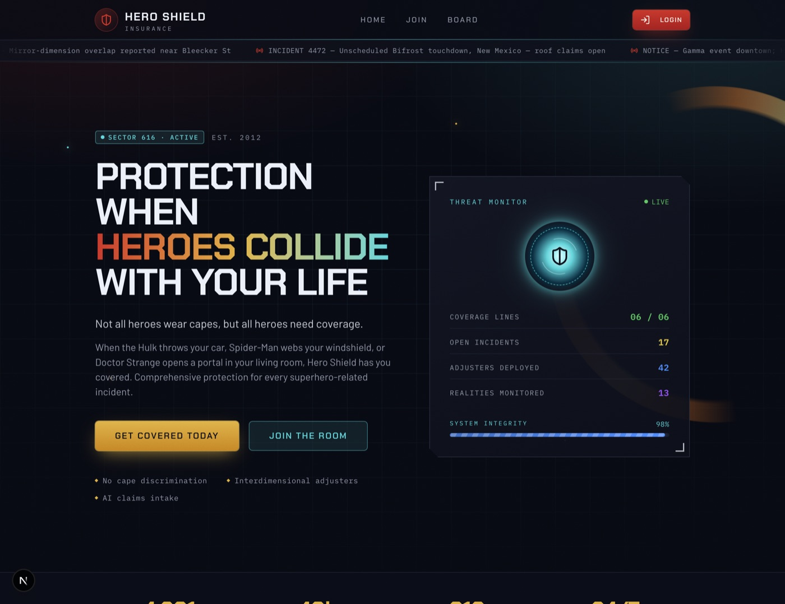
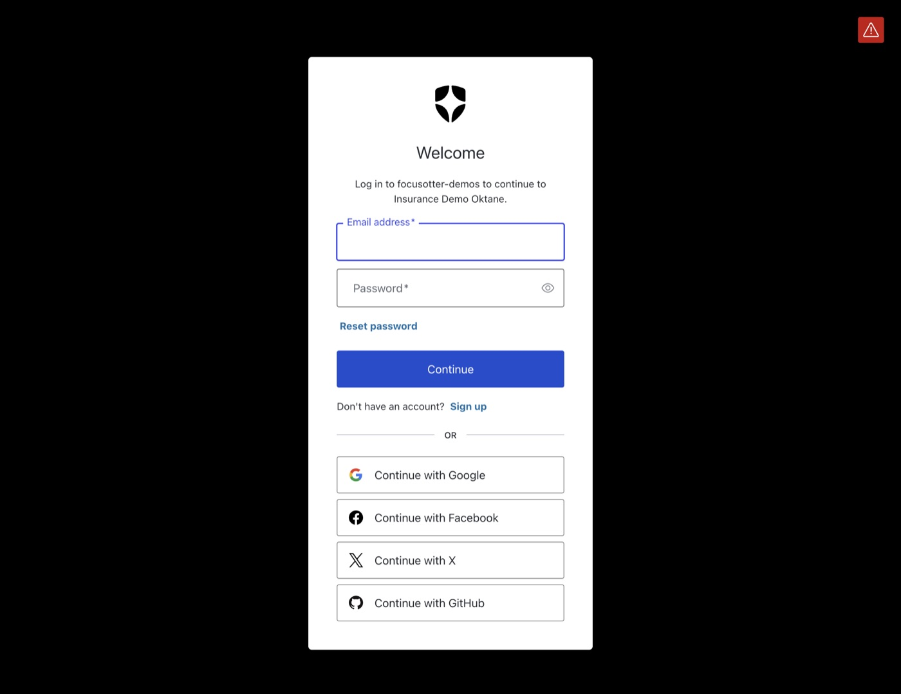
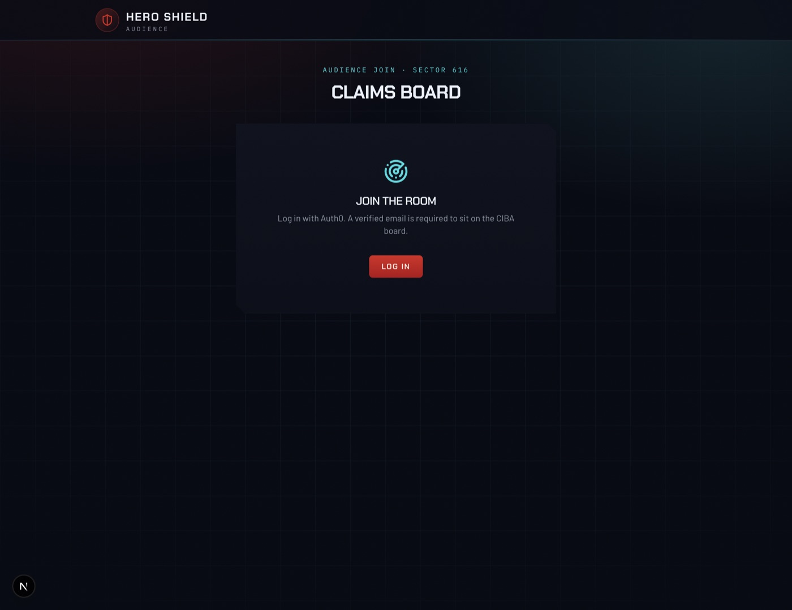

# Hero Shield Insurance

A conference-demo app: superhero car insurance. File a claim by **talking to
an AI agent**, a **logged-in CIBA board** approves it over email, and the
presenter's **Google Calendar** gets the event via Auth0 Token Vault.

Built on Next.js 16 + Auth0 + Neon Postgres + the Vercel AI SDK (AI Gateway,
Anthropic default). It is a port of an earlier AWS/Vite version of the same
demo — same Marvel script on stage, a different grant.

**Setup lives in [SETUP.md](SETUP.md).** Human + agent onboarding
(Neon, Auth0, Vercel AI SDK, CIBA dashboard, MCPs):
**[CONTRIBUTING.md](CONTRIBUTING.md)**.



---

## Auth0 features in this demo

This is an Auth0 product demo. The app uses these Auth0 capabilities
on purpose — they are the point of the talk:

| Feature | Where it shows up |
| ------- | ----------------- |
| **Universal Login** | Every login (`/auth/login`) — audience QR, admin console, filer chat |
| **Regular Web Application** + server session cookie | `@auth0/nextjs-auth0` v4 in [proxy.ts](proxy.ts) / [lib/auth0.ts](lib/auth0.ts). Not a SPA. Needs a client secret. |
| **Email verification** | Unverified joiners watch `/join`; they cannot sit on the CIBA board |
| **Custom ID token claims** | Optional post-login Action sets `https://claims.interview-demo.com/policyId` |
| **CIBA (Client-Initiated Backchannel Authentication)** | Seated board approves the claim from email. `requested_expiry=600` selects the **email** channel, not Guardian. Requires **Essentials (or Professional) + Auth0 for AI Agents add-on**. |
| **CIBA email / Asynchronous Approval template** | Branding → Email Templates → Asynchronous Approval. `login_hint` is `iss_sub`. |
| **Token Vault** | Host-only Google Calendar connect on `/settings` (`/auth/connect`). Audience never sees Google consent. |
| **First-party confidential client** | Required for the CIBA grant (`oidc_conformant`, not `token_endpoint_auth_method: none`) |



CIBA setup, plan requirements, and Token Vault steps:
[CONTRIBUTING.md](CONTRIBUTING.md#auth0-ciba-dashboard).

---

## What the demo does

1. **The room scans one QR.** `/join` sends everyone through Auth0 Universal
   Login so we have `sub`, email, and name. An unverified email can watch the
   room; it cannot sit on the CIBA board.
2. **The presenter picks the board.** An `@okta.com` or
   `admin@focusotter.com` login opens `/host`. They save themselves as
   **demo host** (email + Auth0 `sub`; sub defaults to theirs). The console
   randomly seats the saved board size of verified (non-host) joiners
   (default 1; raise to 6 for the talk). The configured host is never
   seated. Joiner phones flip to "you're on the board."
3. **The filer files the claim in chat.** `/file-claim` is the claims
   agent (white 2006 Honda Pilot, Hulk-smashed car) via the Vercel AI
   Gateway. Confirm submission flips the row to `awaiting_approval`. The
   open `/host` console starts CIBA automatically on its next poll.
4. **CIBA email goes to the seated board, not the room, and never the host.**
   If the host has not connected Google Calendar, we refuse to send. We
   `POST /bc-authorize` per seated member (`login_hint` `iss_sub`,
   `requested_expiry=600`) and store `{authReqId, sub, email, name, status}`.
   The projector ticks as they Accept or Decline.
5. **CIBA yeses at the saved threshold release the claim.** Then we write
   one event on the **host** Google Calendar with Token Vault
   (`getAccessTokenForConnection({ connection: 'google-oauth2' })`).



The CIBA board is the grant.

The interesting part is that **every one of those steps is a row in Postgres**.
Refresh mid-claim and you resume exactly where you were; the board and CIBA
polls are durable.

---

## How it works

```
browser ──▶ proxy.ts ──────────────▶ Route Handler ──▶ lib/agent/run.ts ──▶ Vercel AI Gateway
            (Auth0 session gate)      auth0.getSession()      │  tool loop          (Anthropic default)
                                                              ▼
                                                        lib/claims.ts ──▶ Neon Postgres
                                                              │
submit ──▶ lib/ciba.ts /bc-authorize (× seated) ──▶ poll /oauth/token
                                                              │
threshold yeses ──▶ Token Vault Google token ──▶ Calendar event (host only)
```

**Auth.** [proxy.ts](proxy.ts) — Next.js 16 renamed Middleware to Proxy — mounts
the Auth0 v4 routes (`/auth/login`, `/auth/callback`, `/auth/connect`) and
gates the protected pages. API routes check the session themselves so a
`fetch()` gets `401` JSON instead of an HTML login page.

**CIBA.** [lib/ciba.ts](lib/ciba.ts) copies the working loop from
[mtliendo/ciba-email](https://github.com/mtliendo/ciba-email). This app does
**not** use `@auth0/ai`. `requested_expiry=600` selects the email channel.

**Token Vault.** [lib/auth0.ts](lib/auth0.ts) sets
`enableConnectAccountEndpoint: true`. Audience login is `openid profile email`
only — no calendar scope, no `offline_access`. Only an admin hits
`/settings` → `/auth/connect` for Google Calendar.

**The agent.** [lib/agent/](lib/agent/) is a Vercel AI SDK `generateText`
loop. Same conversation, same three tools. Calls go through the AI Gateway
(`anthropic/claude-opus-5` by default). `publish_claim_submission` flips
the claim to `awaiting_approval` and calls `startCibaForSubmittedClaim`
(admin session only). A non-admin filer gets `not_host`; `GET /api/board`
on the open `/host` console starts the same grant.

**State and realtime.** There is no websocket. `/file-claim` and `/host`
refresh UI every 2s. Auth0 `/oauth/token` is only hit when a pending
`auth_req_id` is due.

### Routes

| Route | Auth | Purpose |
| ----- | ---- | ------- |
| `/` | public | Marketing landing page |
| `/join` | login | QR landing — join the room, see board seat |
| `/host` | admin (`@okta.com` or `admin@focusotter.com`) | QR, demo host, board rules, pick, projector CIBA board |
| `/settings` | admin | Connect Google Calendar (Token Vault) |
| `/file-claim` | protected | Chat with the claims agent; live board sidebar |
| `/profile` | protected | Auth0 profile and the `policyId` custom claim |
| `POST /api/claims` | protected | Starts or resumes the caller's claim |
| `POST /api/claims/reset` | admin | Wipe projector claim + chat / CIBA + seated board |
| `GET /api/claims/[id]` | protected | Claim snapshot; admin ticks due CIBA ids |
| `POST /api/claims/[id]/chat` | protected | One agent turn (AI Gateway) |
| `GET \| POST /api/join` | login | Upsert joiner; seat / CIBA status for this phone |
| `GET /api/board` | admin | Joiners + live board + CIBA snapshot; auto-starts CIBA |
| `POST /api/board/pick` | admin | Randomly seat the saved board size (pins first) |
| `POST /api/board/settings` | admin | Save board size and CIBA yes threshold |
| `POST /api/board/host` | admin | Save demo host email + Auth0 sub |
| `GET \| POST /api/ciba` | admin | Board status; fallback start if auto-start failed |
| `POST /api/ciba/poll` | admin | Tick due `/oauth/token` per `auth_req_id` |
| `GET /api/connection-status` | admin | Token Vault Google connected? |

---

## Running it

The app will not start a useful claims chat without these in `.env.local`:

| Key | Why |
| --- | --- |
| Auth0 (`AUTH0_DOMAIN`, `AUTH0_CLIENT_ID`, `AUTH0_CLIENT_SECRET`, `AUTH0_SECRET`) | Universal Login + session cookie |
| `DATABASE_URL` | Neon |
| **`AI_GATEWAY_API_KEY`** | Vercel AI Gateway. Required for `/file-claim`. There is no Anthropic key — do not set `ANTHROPIC_API_KEY`. |

Mint the gateway key at
[Vercel AI Gateway API keys](https://vercel.com/d?to=%2F%5Bteam%5D%2F%7E%2Fai-gateway%2Fapi-keys).
On a linked Vercel project you can use `vercel env pull` (`VERCEL_OIDC_TOKEN`)
instead. Restart `pnpm dev` after editing `.env.local`.

```bash
pnpm install
pnpm dev          # http://localhost:3000
pnpm build        # typecheck + production build
pnpm lint
```

Full environment and database setup: **[SETUP.md](SETUP.md)**.
CIBA plan + dashboard: **[CONTRIBUTING.md](CONTRIBUTING.md#auth0-ciba-dashboard)**.

## Rehearsal defaults (1 / 1)

Code, seed, and UI default to **pick 1 / 1 yes**. The presenter sets the
live values on **`/host` → Board rules** (board size and CIBA yes
threshold). Those persist in Neon `demo_settings`. Raise to **6 / 3** on
`/host` for the real talk.

## Running the demo on stage

1. Presenter signs in with an admin email (`@okta.com` or
   `admin@focusotter.com`), opens `/host`, saves **Demo host** (their
   email + `sub`), then `/settings` → Connect Google Calendar.
2. Projector on `/host`. Audience scans the QR → Auth0 login → `/join`.
3. **Pick board.** Seated phones show "you're on the board."
4. Filer files the Hulk-smashed-car claim on `/file-claim`. Confirm
   submission. With `/host` open, the host poll starts CIBA.
5. CIBA emails go out to the seated board (`requested_expiry=600`). The
   projector ticks pending → approved / denied.
6. Yeses at the saved threshold approve the claim, confetti fires, and a
   calendar event lands on the host Google account.

Between runs, tap **Start over** on `/file-claim` or `/host` (admin only).
